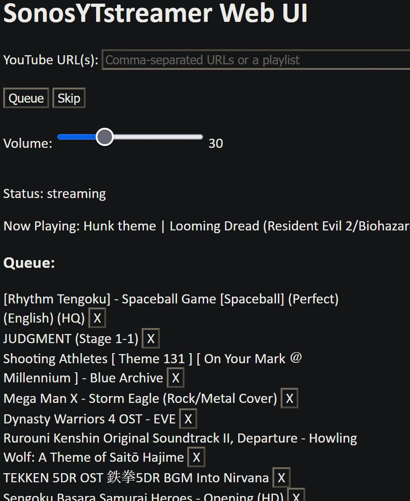

# SonosYTstreamer
Simple tool to stream YouTube videos to Sonos speakers



I made this tool because I was previously using SonosTube for Android, and it's very unreliable (probably not their fault), and didn't seem like there were any other alternatives. 

### Setup
- Create an .env file in root directory with these parameters:

```
SONOS_IP=your speaker IP address (ex. 192.168.1.69)
STREAM_PORT=your speaker' port (ex. 8002)
WEB_PORT=the web UI port (ex. 8001)
```
- Have Python 3.10 at least
- Run `run.bat`. It will set up a local Python environment, download ffmpeg, then run the server.

### Usage
- Open the web ui. It'll show in the console as, "Web control running on [url]"
- Paste a YouTube video URL or playlist into the input field.
- Click Queue.
- Wait for it to buffer.

### Features
- Supports multiple speakers (one speaker is designated as the coordinator)
- Volume changing
- Skip to go to next track in queue.
- Can remove tracks in queue.

### Known issues and other things
- Doesn't support live streams.
- Doesn't show video length or current position (may add this later). 
- No retry if a link doesn't queue properly (it will just drop).
- Can't reorder queue.
- Probably a bunch of bugs I haven't caught.
- Only tested on a pair of Sonos One.
